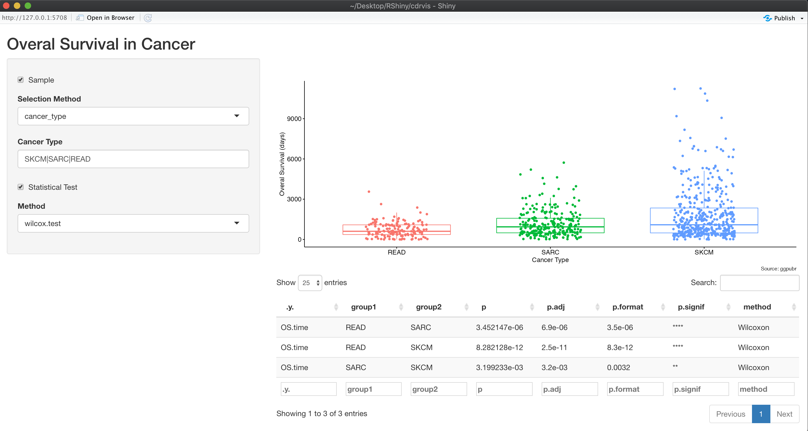

# **cdrvis: Overall survival in cancer visualization package - Quick Start**

## **Table of contents**
1. [Overview](#p1)
2. [Method Summary](#p2)
3. [Package Usage](#p3)
    1. [Before you start](#p3.1)
    2. [Function usage](#p3.2)
        1. [getData()](#p3.2.1)
        2. [getPlot()](#p3.2.2)
        3. [getContrasts()](#p3.2.3)
    3. [Shiny app usage](#p3.3)
4. [Expected Outputs](#p4)

## **1. Overview** 
The cdrviz package automatically obtains and imports biomedical data from a spreadsheet. The current version data is available at [this link](https://api.gdc.cancer.gov/data/1b5f413e-a8d1-4d10-92eb-7c4ae739ed81) from [TCGA](https://www.cancer.gov/about-nci/organization/ccg/research/structural-genomics/tcga) (The Cancer Genome Atlas). In this version we only obtained the data for patients with known tumour status.

## **2. Method Summary** 
The package contains three individual functions that are responsible for obtaining the dataset, filtering, visualization and statistical tests.

* `getData()`: Obtains the data from the first sheet of an Excel spreadsheet and filters the dataset for patients with known tumour status. [`xlsx::read.xlsx`](https://www.rdocumentation.org/packages/xlsx/versions/0.6.5/topics/read.xlsx) and [`dplyr::filter`](https://dplyr.tidyverse.org/reference/filter.html) modules were used in this function.

* `getPlot()`: Creates a boxplot to compare overall survival (from the `OS.time` column) for the set of
samples exclusively filtered by Cancers or patient ID. [`rlang::check_exclusive`](https://rlang.r-lib.org/reference/check_exclusive.html), [`dplyr::filter`](https://dplyr.tidyverse.org/reference/filter.html) and [`ggpubr::ggboxplot`](http://rpkgs.datanovia.com/ggpubr/reference/ggboxplot.html) are main modules used in this function. `getPlot()` function includes the following arguments:
    *   `cancer_type` (character vector): rows of interest (single or multiple; data from the `type` column). 
    *   `patient_id` (character vector) - IDs of patients of interest (data from the `bcr_patient_barcode` column).

* `getContrasts()`: A function for statistical testing to determine whether a variable is significantly different between two groups for the dataset of interest. The statistical testing performs on the same subset of data selected in the `getPlot()`function for data visualization. [`ggpubr::compare_means`](https://rpkgs.datanovia.com/ggpubr/reference/compare_means.html) module was used in this function. Since `getContrasts()` function performs comparisons between only two groups of samples, `t.test` (parametric) and `wilcox.test` (non-parametric) were used. `wilcox.test` is much more robust against outliers and heavy tail distributions and it does not require a special distribution of the dependent variable in the analysis. Therefore unlike `t.test`, `wilcox.test` is the best test to compare mean scores when the dependent variable is not normally distributed and at least of ordinal scale.

## **3. Package Usage** 
The package contains following folders and files:
* **R**: contains R files required for each function
* **data**: contains dataset used in current version of the package
* **man**: contains individual markdown files for each function
* **app.R**: a Shiny app to interactively evaluate the package
* **cdrvis.Rproj**: the R project file
* **DESCRIPTION**: provides overall metadata about the package
* **LICENCE.md**: manages licensing for the package
* **NAMESPACE**: describes which functions you use from other packages and you expose to the world

### **3.1. Before you start** 
Following steps are required to install cdrvis package hosted on GitHub.
The devtools package provides install_github() that enables installing packages from GitHub.

    library(devtools)
    devtools::install_github("jahanshah/cdrvis")
    library(cdrvis)

### **3.2. Function usage** 
#### **3.2.1 getData()** 
Only argument is an excel spreadsheet with the data in the first sheet.

    getData(input_file = "data/TCGA-CDR-SupplementalTableS1.xlsx")
#### **3.2.2 getPlot()** 
`cancer_type` and `patient_id` parameters are exclusive. In another word, if one is selected the other one must be `NULL`.

    getPlot(data = data, cancer_type = 'SKCM|SARC|READ|COAD')
    getPlot(data = data, patient_id = 'TTCGA-5N-A9KM|TCGA-BL-A0C8|TCGA-BL-A13I|TCGA-BL-A13J')
#### **3.2.3 getContrasts()** 
Only `t.test` or `wilcox.test` methods are available.
    getContrasts(data = data, test.method = c("t.test", "wilcox.test"))
### **3.3. Shiny app usage** 
    runApp()
### **4. Expected Outputs** 
 The above command will provide the outputs as listed below:

* A boxplot that compares distribution of overall survival in different cancers based for the selected samples
* A table contains the statistical information based on the selected statistic test
